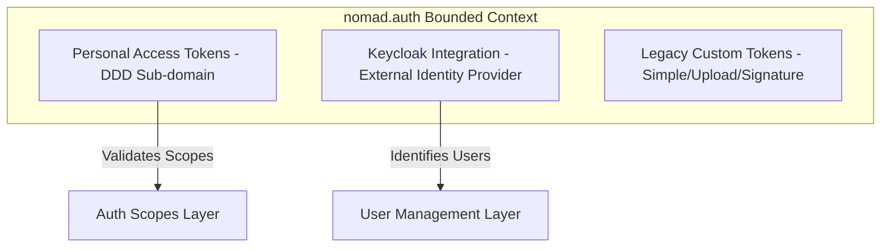
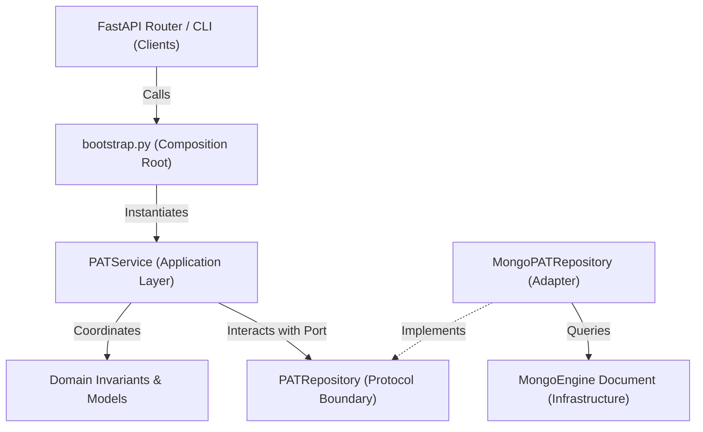

# Bounded Context: Authentication & Authorization (`nomad.auth`)

This document defines the architectural patterns and boundaries for the `nomad.auth` bounded context, with a focus on the domain-driven design (DDD) model introduced for Personal Access Tokens (PAT).

---

## 1. Domain Context Map & Boundaries

The `nomad.auth` bounded context handles authentication and user identity scopes within NOMAD. The context is divided into distinct sub-domains:

---

## 2. Personal Access Tokens (PAT) Hexagonal Architecture

To decouple the business logic from infrastructure implementation details, the PAT sub-domain is structured using the Hexagonal Architecture (Ports & Adapters) pattern:

### A. Domain Layer (`nomad/auth/pat/domain.py`)
- **Purity**: Zero external dependencies (no databases, ODM/ORM, or web frameworks).
- **Core Entities & Value Objects**:
  - `PATRecord`: An immutable, frozen representation of a token (`dataclass(frozen=True)`).
  - `PATSecret`: Logic to generate raw tokens and calculate cryptographic hashes.
  - `PATState`: Enum representing the token states (`active`, `revoked`, `expired`).
- **Domain Rules**:
  - Core business invariants (e.g., scope restrictions, lifespan limits, revocation precedence) are executed via pure functions like `validate_creation` and `resolve_prune_cutoff`.

### B. Ports & Boundary Layer (`nomad/auth/pat/ports.py`)
- **Interface (Port)**:
  - Defines `PATRepository` as a `typing.Protocol` declaring the expected persistence capabilities without referencing database concepts.
- **Application Models**:
  - Defines data transfer objects (DTOs) representing query parameters and input structures (`PATCreationData`, `PATQuerySpec`, `PATSortOrder`).

### C. Application Layer (`nomad/auth/pat/application.py`)
- **Orchestration**: Defines the application service (`PATService`) managing token workflows (token creation, rotation, revocation, authentication, pruning).
- **Dependency Inversion**:
  - `PATService` receives the `PATRepository` interface and clock Callable via constructor dependency injection, meaning the application layer is completely decoupled from any knowledge of MongoDB or the concrete database adapter.

### D. Infrastructure Layer (`nomad/auth/pat/mongo_repository.py`)
- **Concrete Adapter**:
  - Implements `MongoPATRepository` matching the `PATRepository` protocol using MongoEngine.
  - Translates the persistence-level documents into immutable domain records (`PATRecord`), shielding the rest of the application from database driver classes.

### E. Composition Root (`nomad/auth/pat/bootstrap.py`)
- **Wiring**: Instantiates and exposes the production-bound service instance (`pat_service = PATService(repository=MongoPATRepository(), clock=now)`). Clients like the FastAPI router and CLI admin tools import `pat_service` directly from this bootstrap module.
